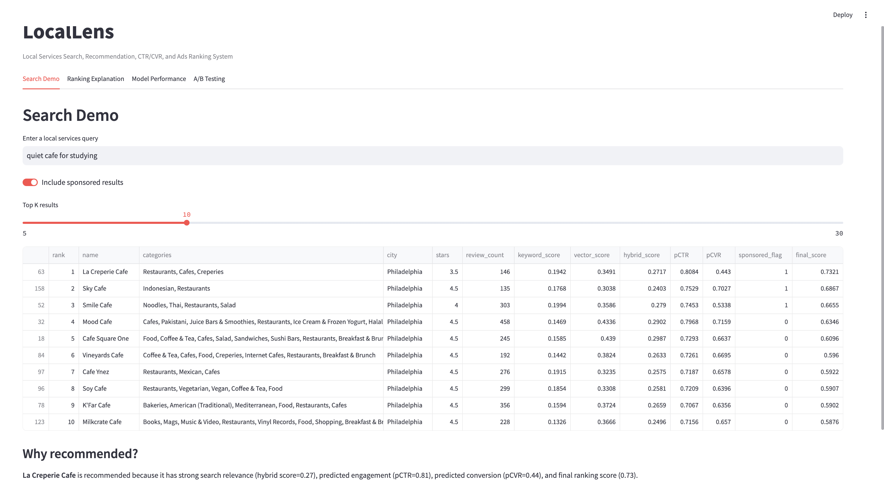
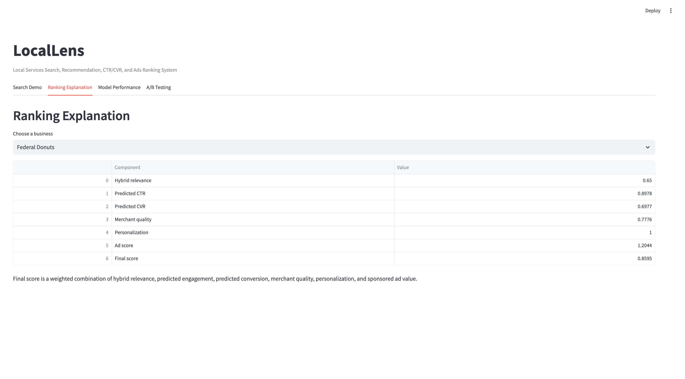
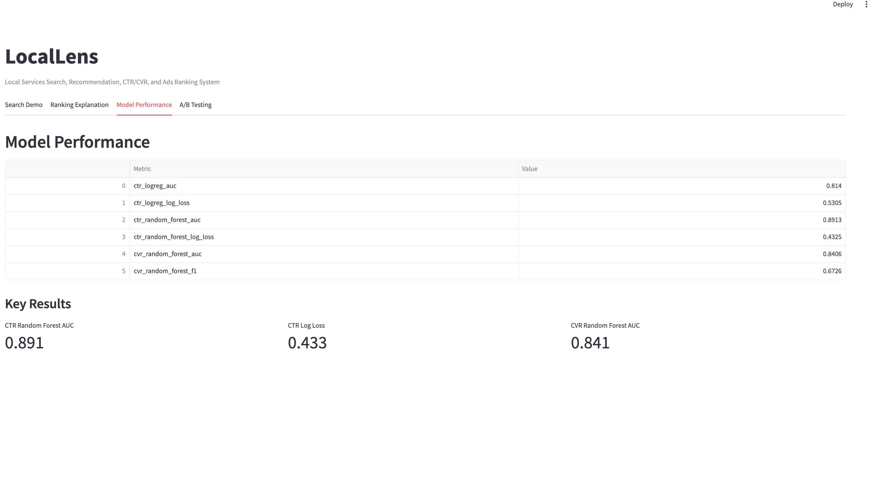
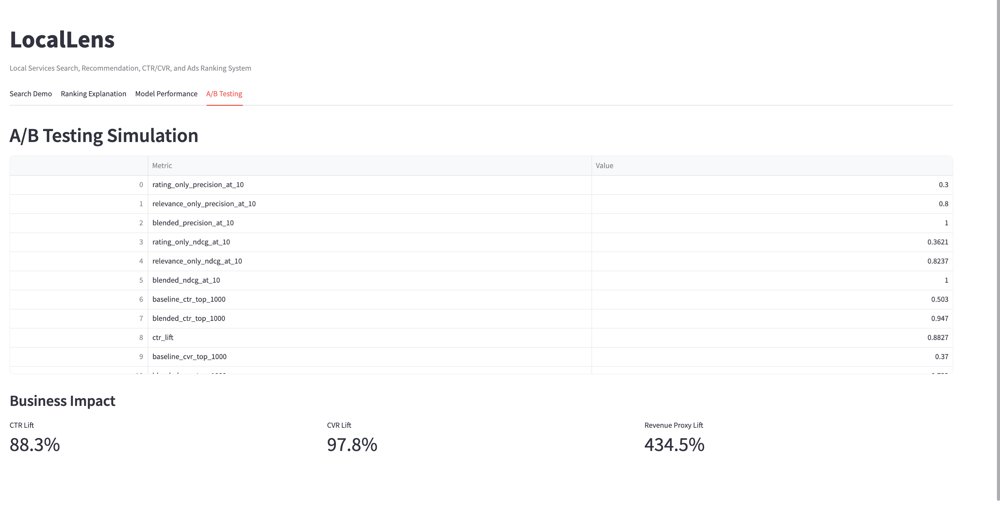

# LocalLens

LocalLens is a local services search, recommendation, CTR/CVR prediction, and sponsored ads ranking system built with the Yelp Open Dataset.

The project simulates how a local marketplace search product ranks restaurants, cafes, and local businesses using hybrid retrieval, predicted user engagement, predicted conversion likelihood, merchant quality, and sponsored ad value.

**Target marketplace:** Philadelphia, PA
**Dataset:** Yelp Open Dataset

---

## Project Overview

LocalLens answers a product-style ranking question:

> Given a user search query such as “quiet cafe for studying,” how should a local marketplace rank businesses to balance relevance, user engagement, conversion likelihood, merchant quality, and advertising value?

The system includes:

* Data cleaning and sampling pipeline
* Business profile generation
* User-business interaction labeling
* Negative sample generation
* TF-IDF keyword retrieval
* Sentence-transformer semantic retrieval
* Hybrid retrieval scoring
* CTR and CVR prediction models
* Organic and sponsored ranking system
* A/B testing simulation
* Streamlit dashboard

---

## Dashboard Preview

### Search Demo



### Ranking Explanation



### Model Performance



### A/B Testing



---

## Data

This project uses the Yelp Open Dataset. The raw dataset is not uploaded to GitHub because it is too large.

Main raw files used:

* `yelp_academic_dataset_business.json`
* `yelp_academic_dataset_review.json`
* `yelp_academic_dataset_user.json`
* `yelp_academic_dataset_tip.json`
* `yelp_academic_dataset_checkin.json`

Processed files generated locally:

* `business_clean.csv`
* `reviews_clean.csv`
* `interactions.csv`
* `training_features.csv`
* `ranking_results.csv`
* `sponsored_ranking_results.csv`
* `ab_testing_results.csv`

---

## System Pipeline

### 1. Data Processing

The project first cleans Yelp business data and focuses on local service businesses in Philadelphia.

A business profile is created for each merchant using name, location, rating, review count, and categories.

Example profile:

```text
Cafe Lift is a local business in Philadelphia, PA. It has 4.0 stars and 1200 reviews. Categories include Breakfast & Brunch, Cafes, Coffee & Tea.
```

### 2. Interaction Labeling

Positive interactions are created from Yelp reviews:

* `clicked = 1` if a user reviewed a business
* `converted = 1` if the review rating is greater than or equal to 4

Negative samples are generated by pairing users with businesses they did not review.

### 3. Hybrid Retrieval

The retrieval system combines two methods:

* **Keyword retrieval:** TF-IDF over business profiles
* **Semantic retrieval:** Sentence-transformer embeddings

The final hybrid relevance score is:

```text
hybrid_score = 0.5 * keyword_score + 0.5 * vector_score
```

### 4. Feature Engineering

The model uses business, query, retrieval, and advertising features, including:

* Business rating
* Review count
* Merchant quality
* Query intent features
* Category match
* Keyword score
* Vector score
* Hybrid score
* Sponsored flag
* Simulated bid

### 5. CTR and CVR Modeling

The system trains machine learning models to predict:

* **pCTR:** probability of user click / interaction
* **pCVR:** probability of positive conversion

Models used:

* Logistic Regression baseline
* Random Forest main model

### 6. Ranking System

The final ranking score combines relevance, predicted engagement, predicted conversion, merchant quality, personalization, and sponsored ad value.

```text
organic_score =
    0.35 * hybrid_score
  + 0.25 * pCTR
  + 0.15 * pCVR
  + 0.15 * merchant_quality
  + 0.10 * personalization_score
```

```text
ad_score = bid * pCTR * merchant_quality
```

```text
final_score = 0.80 * organic_score + 0.20 * ad_score
```

### 7. A/B Testing Simulation

The project compares ranking strategies:

* Rating-only baseline
* Relevance-only baseline
* Blended ranking model

Evaluation metrics include:

* Precision@10
* NDCG@10
* CTR lift
* CVR lift
* Revenue proxy lift

---

## Model Results

Example model performance:

| Metric                      | Value |
| --------------------------- | ----: |
| CTR Logistic Regression AUC | 0.814 |
| CTR Random Forest AUC       | 0.896 |
| CTR Random Forest Log Loss  | 0.421 |
| CVR Random Forest AUC       | 0.843 |
| CVR Random Forest F1        | 0.659 |

---

## A/B Testing Results

Example simulated business impact:

| Metric             | Result |
| ------------------ | -----: |
| CTR Lift           |  88.3% |
| CVR Lift           |  97.8% |
| Revenue Proxy Lift | 434.5% |

These results are based on simulated interaction and advertising labels, so they should be interpreted as a product-ranking simulation rather than a production causal experiment.

---

## Project Structure

```text
local-lens/
├── app/
│   └── streamlit_app.py
├── data/
│   ├── raw/
│   ├── processed/
│   └── sample/
├── models/
│   ├── ctr_model.pkl
│   └── cvr_model.pkl
├── reports/
│   ├── figures/
│   ├── model_metrics.json
│   └── ab_testing_results.json
├── src/
│   ├── data_processing.py
│   ├── retrieval.py
│   ├── feature_engineering.py
│   ├── modeling.py
│   ├── ranking.py
│   ├── ads_ranking.py
│   └── evaluation.py
├── requirements.txt
└── README.md
```

---

## How to Run

### 1. Install dependencies

```bash
pip install -r requirements.txt
```

### 2. Run data processing

```bash
python src/data_processing.py
```

### 3. Build training features

```bash
python src/feature_engineering.py
```

### 4. Train CTR and CVR models

```bash
python src/modeling.py
```

### 5. Generate ranking results

```bash
python src/ranking.py
python src/ads_ranking.py
```

### 6. Run A/B testing simulation

```bash
python src/evaluation.py
```

### 7. Launch Streamlit dashboard

```bash
streamlit run app/streamlit_app.py
```

Then open:

```text
http://localhost:8501
```

---

## Tech Stack

* Python
* Pandas
* Scikit-learn
* Sentence Transformers
* Random Forest
* Logistic Regression
* Streamlit
* Git / GitHub

---

## Notes

The raw Yelp data and generated processed CSV files are excluded from GitHub because of file size limits. The repository includes source code, reports, metrics, and dashboard screenshots.
